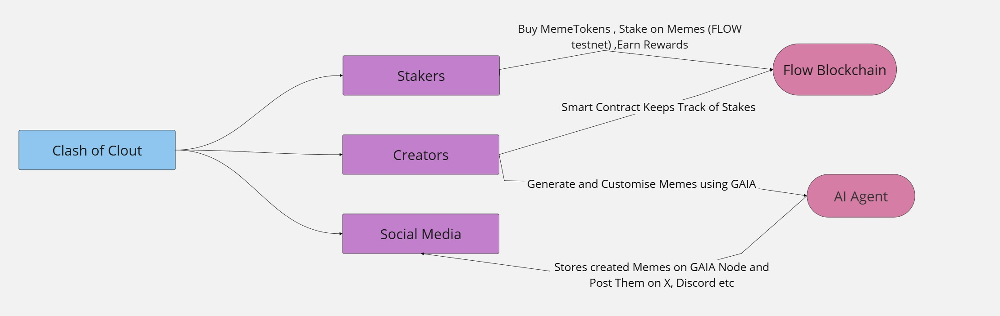
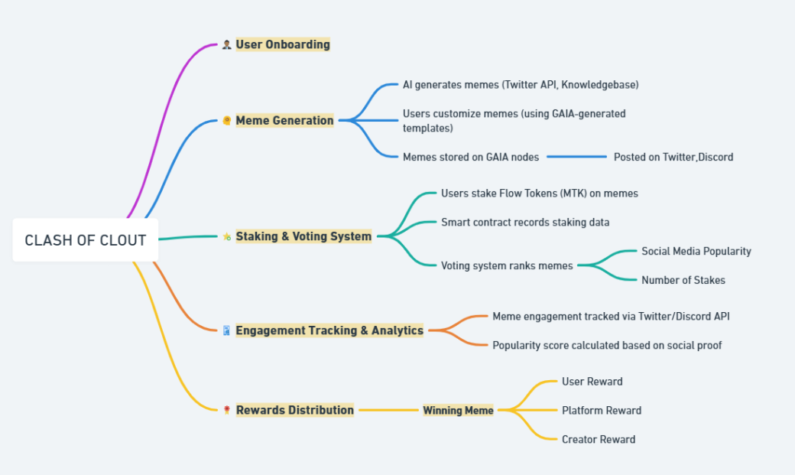

# 🎭 Clash-of-Clout - The ultimate AI MEME battle!
<p align="center">
  
</p>
An AI-Genereted meme battle platform where creativity meets crypto rewards. Where Memes Reign, Tokens Flow, and Clout is King!


## 🚀 Overview

Clash of Clout is a revolutionary platform where 🎨 AI-generated memes meet crypto trends, powered by GAIA nodes and real-time analytics using Knowledgebase. Our ecosystem combines 📊 cross-platform social engagement tracking (Twitter + Discord), 💎 Flow chain token staking, and 🎮 gamified competitions where creators stake, vote and earn rewards through transparent smart contracts on flow chain. Join thousands of creators in the ultimate meme battle arena - create, compete, and earn in the new era of viral content! ⚡

## ✨ Core Features

### 🤖 AI-Powered Creation

- Real-time crypto trend analysis
- Knowledge base powered meme generation
- GAIANET template integration
- Cross-platform posting (Twitter/Discord)

### 💎 Tokenized Economy

- Flow Token-based staking
- Smart contract reward distribution:
  - 70% creators
  - 20% stakers
  - 10% platform
- Transparent stake management

### 📊 Engagement & Analytics

- Real-time performance tracking
- Automated popularity scoring
- Social proof verification
- Cross-platform metrics
- Twitter API connectivity
- Discord API integration

## 🛠 Technical Stack

- **Frontend**: Next.js, TypeScript
- **Backend**: Express, CollabLand AI-Agent-Kit
- **Blockchain**: Flow Testnet
- **Storage**: GAIANET
- **AI/Social**: Twitter API, Knowledgebase from Twitter

## 🔄 Core Workflow

1. AI generates trending memes
2. Social platform distribution
3. Token staking & voting
4. Engagement tracking
5. Smart contract rewards
6. Winner distribution

## 🌍 Global Impact

By democratizing meme creation and rewards, Clash-of-Clout empowers creators worldwide to:

- Participate in viral content creation
- Earn rewards for creativity
- Build global community engagement

## 🔗 Technical Integration

### 🤖 AI Agent Integration (CollabLand)

- Leveraging CollabLand's AI-Agent-Starter-Kit for intelligent meme analysis
- Custom actions for meme generation and engagement tracking
- Memory management for context-aware responses

### 📚 Knowledge Base & GAIA Node

- Decentralized storage via GAIA node for meme templates and metadata
- Integrated knowledge base for trending crypto topics
- Real-time data synchronization with GAIA network
- Secure content distribution across nodes

### 💎 Flow Blockchain Integration

- Custom MTK token minted from Flow Token
- Smart contracts for:
  - Token minting and distribution
  - Meme staking mechanism
  - Reward calculation and distribution
- Flow testnet deployment for:
  - Stake management
  - Voting system
  - Reward distribution
  - Transaction verification

### 🔄 Integration Flow

1. AI Agent processes market trends and generates meme concepts
2. GAIA node stores and distributes meme templates
3. Users mint MTK tokens from Flow Token
4. Staking system allows MTK token placement on memes
5. Smart contracts track engagement and distribute rewards
6. Winners receive MTK tokens on Flow testnet

## 👤  User Flow
<p align="center">
  
</p>

## 🏗 Clash of Clout Architecture
<p align="center">
  
</p>

## 💡 Competitive Advantages

| Feature             | Traditional Platforms | Clash-of-Clout     |
| ------------------- | --------------------- | ------------------ |
| Content Creation    | Manual                | AI-Assisted        |
| Reward System       | Limited               | Token-Based        |
| Engagement Tracking | Basic                 | Advanced Analytics |
| Payment Speed       | Delayed               | Instant            |
| Community Input     | Minimal               | Stake-Based Voting |

Join us in revolutionizing the crypto meme economy! 🚀

## 🚀 Getting Started

1. Prerequisites:

```bash
node >= 22 🟢
pnpm >= 9.14.1 📦
```

2. Install dependencies:

```bash
pnpm install
```

3. Run the predev script:

```bash
pnpm run predev
```

4. Fire up the dev servers:

```bash
pnpm run dev
```

## 📁 Repository Structure

```
├── 📦 client/                 # Next.js frontend
├── ⚙️ server/               # Express.js backend
├── 📝 .env.example         # Root environment variables example for server
├── 🔧 package.json         # Root package with workspace config
```

## Backend

You should first run a gaianet node and add the GAIA_NODE_DOMAIN environment variable.

### Scripts

```bash
pnpm run dev        # Development mode
pnpm run build     # Build actions
pnpm run watch     # Watch mode
```

## Team

We are an incredible team of 3 developers. ✨

- Yagnesh Markana, role: Front-End Developer https://x.com/Yagneshh28

- Anushka Somani, role: Smart Contract Developer https://x.com/ishbubbles1 https://www.linkedin.com/in/anushka-somani1

- Salim Boujaddi, role: Back-end developer https://x.com/0xonetwothree https://www.linkedin.com/in/salim-boujaddi/
